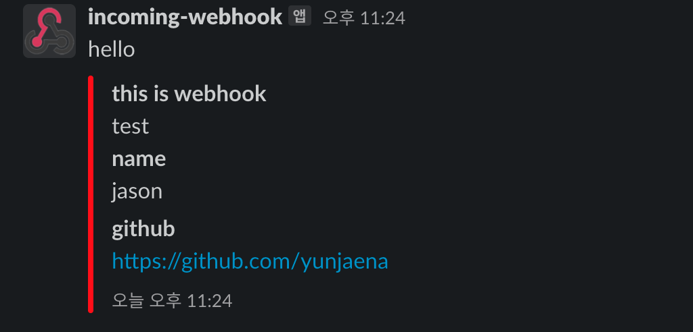

<p>
    <h1 align="center">
            Slack Webhook Util For Android
    </h1>
</p>

<p align="center">
    <a href="https://travis-ci.org/steverichey/google-play-badge-svg">
        
    </a>
    <a href="./license.md">
        
    </a>
    <a href="https://search.maven.org/artifact/io.github.yunjaena/slackwebhookandroid">
    </a>
</p>

<p align="center">
  • <a href="#about">About</a>
  • <a href="#setup">Setup</a>
  • <a href="#how-to-use">How to use</a>
  • <a href="#license">License</a>
</p>

## About

"Slack Webhook Util" 은 안드로이드에서 Webhook을 쉽게 보내기 위한 라이브러리 입니다.

- Builder 패턴으로 제공
  - Builder 패턴을 사용해서 원하는 형식의 메시지를 보낼 수 있습니다.

- 간단한 사용
  - Builder 패턴을 사용해서 메시지 객체를 생성 후 send(Context) 만 호출하면 네트워크가 통신이 될때 보내집니다!

## Setup

### Before Setting

1. Slack에 ["incoming-webhook"](https://slack-webhook-test-hq.slack.com/apps/A0F7XDUAZ--) app을 설치합니다.
2. 웹 후크 URL이 생성이 됩니다. ex) https://hooks.slack.com/services/12345/6789
3. https://hooks.slack.com/ 뒤에 `services/12345/6789` 를 복사 합니다. 해당 path를 통해서 Webhook을 보내게 됩니다.

### Gradle

<a href="https://search.maven.org/artifact/io.github.yunjaena/slackwebhookandroid">
</a>

```groovy
dependencies {
    implementation 'io.github.yunjaena:slackwebhookandroid:x.y.z'
    // x.y.z => Recent Release
}
```

### Android Manifest

- AndroidManifest.xml 에 meta data로 위에 복사한 path를 복사해주세요.

```xml
<meta-data
          android:name="slack_webhook_path"
          android:value="services/12345/6789"
/>
```

## How To Use

### Simple Example

  - Builder를 사용하여서 보내고 싶은 내용을 세팅하고 send(context)를 통해서 메시지를 보낼 수 있습니다.

```kotlin
SlackWebHook.builder()
             .pretext("hello")
             .title("this is webhook")
             .text("test")
             .color("#FF0000")
             .timeStampEnabled(true)
             .fields("name" to "jason", "github" to "https://github.com/yunjaena")
             .build()
             .send(this)
```

<p align="center">
  
</p>

### Function

  - pretext(pretext: String)
  - fallback(fallback: String)
  - title(title: String)
  - text(text: String)
  - authorName(authorName: String)
  - authorLink(authorLink: String)
  - authorIcon(authorIcon: String)
  - fields(vararg fields: Pair<String, String>)
  - color(color: String)
  - imageUrl(imageUrl: String)
  - thumbUrl(thumbUrl: String)
  - footer(footer: String)
  - footerIcon(footerIcon: String)
  - timeStampEnabled(isTimeStampEnable: Boolean)
  - send(context: Context)

## License

```
Copyright 2021 yunjaena

Licensed under the Apache License, Version 2.0 (the "License");
you may not use this file except in compliance with the License.
You may obtain a copy of the License at

    http://www.apache.org/licenses/LICENSE-2.0

Unless required by applicable law or agreed to in writing, software
distributed under the License is distributed on an "AS IS" BASIS,
WITHOUT WARRANTIES OR CONDITIONS OF ANY KIND, either express or implied.
See the License for the specific language governing permissions and
limitations under the License.
```
